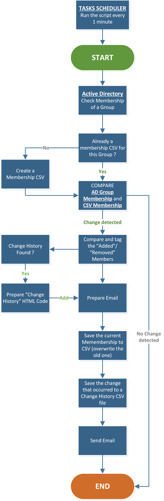

AD-GROUP-Monitor_MemberShip
============

[Blog Articles on LazyWinAdmin.com](http://www.lazywinadmin.com/2013/11/update-powershell-monitor-and-report.html)

PowerShell script to monitor Active Directory groups and send an email when someone is changing the membership

# Report Example


# Features

You can specify the group Name, SID(Security Identifier), GUID(Globally Unique IDentifier) or DN (Distinguished Name).
Group name like 'DOMAIN\GROUPNAME' will also work.

**Comparing**
The membership of each group is saved in a CSV file "DOMAIN_GROUPNAME-membership.csv"
If the file does not exist, the script will create one, so the next time it will be able to compare the  membership with this file.

**Change History**
Each time a change is detected (Add or Remove an Account (Nested or Not)) a CSV file will be generated with the following name: "DOMAIN_GROUPNAME-ChangesHistory-yyyyMMdd-hhmmss.csv"

When generating the HTML Report, the script will add this Change History to the Email (if there is one to add)

**Reporting**
Here is an example of report generated when a change is detected.
You can see the user 'catfx' was removed from the group FX\FXGROUP
Also, If the script find some Change History files for this group, it will be added to the report.
Finally at the end of the report, information on when, where and who ran the script.

# Requirements
* Read Permission in Active Directory on the monitored groups
* Module
 * Microsoft ActiveDirectory Module
 * **OR**
 * Quest Active Directory PowerShell Snapin
* A Scheduled Task (in order to check every X seconds/minutes/hours)


# Using the Script
``` powershell
.\TOOL-MONITOR-AD_Group.ps1 -group "FXGroup01","FXGroup02" -Emailfrom Reporting@fx.lab -Emailto "Catfx@fx.lab" -EmailServer 192.168.1.10 -Verbose
```


# Workflow



# Version History
* 2.0.2	2015.01.14
 * FIX an small issue with the $StateFile which did not contains the domain
 * ADD the property Name into the final output.
 * ADD Support to export the report to a HTML file (-HTMLLog) It will save the report under the folder HTML
 * ADD Support for alternative Email Encoding: Body and Subject. Default is ASCII.

* 2.0.1 	2015.01.05
 * REMOVE the DisplayName property from the email
 * ADD more clear details/Comments
 * RENAME a couple of Verbose and Warning Messages
 * FIX the DN of the group in the Summary
 * FIX SearchBase/SearchRoot Parameter which was not working with AD Module
 * FIX Some other minor issues
 * ADD Check to validate data added to $Group is valid
 * ADD Server Parameter to be able to specify a domain controller

* 2.0	2014.05.04
 * ADD Support for ActiveDirectory module (AD module is use by default)
 * ADD failover to Quest AD Cmdlet if AD module is available
 * RENAME GetQADGroupParams variable to ADGroupParams	
		
* 1.8 	2013.11.27
 * Minor syntax changes
 * UPDATE Help
 * Rename to AD-GROUP-Monitor_MemberShip
 * Update Notes
	
* 1.7 	2013.11.23
 * ADD ValidateScript on File Parameter
 * ADD Additional information about the Group in the Report
 * CHANGE the format of the $changes output, it will now include the DateTime Property
 * UPDATE Help
 * ADD DisplayName Property in the report
		

* 1.6 	2013.11.21
 * ADD Support for Organizational Unit (SearchRoot parameter)
 * ADD Support for file input (File Parameter)
 * ADD ParamaterSetNames and parameters GroupType/GroupScope/SearchScope
 * REMOVE [mailaddress] type on $Emailfrom and $EmailTo to make the script available to PowerShell 2.0
 * ADD Regular expression validation on $Emailfrom and $EmailTo

* 1.5 	2013.10.13
 * ADD the full Parameter Names for each Cmdlets used in this script
 * ADD Alias to the Group ParameterName

* 1.4 	2013.10.11
 * CHANGE the 'Change History' filename to "DOMAIN_GROUPNAME-ChangesHistory-yyyyMMdd-hhmmss.csv"
 * UPDATE Comments Based Help
 * ADD Some Variable Parameters
	
* 1.3 	2013.10.05
 * CHANGE in the PROCESS BLOCK, the TRY CATCH blocks and placed them inside the FOREACH instead of inside the TRY block
 * ADD support for Verbose
 * CHANGE the output file name "DOMAIN_GROUPNAME-membership.csv"
 * ADD a Change History File for each group(s) example: "GROUPNAME-ChangesHistory-yyyyMMdd-hhmmss.csv"
 * ADD more Error Handling
 * ADD a HTML Report instead of plain text
 * ADD HTML header
 * ADD HTML header for change history

* 1.2 	2013.09.23
 * FIX issue when specifying group with domain 'DOMAIN\Group'
 * CHANGE Script Format (BEGIN, PROCESS, END)
 * ADD Minimal Error handling. (TRY CATCH)

* 1.1 	2012.03.13
 * CHANGE to monitor both Domain Admins and Enterprise Admins

* 1.0 	2012.02.01
 * Initial Version
