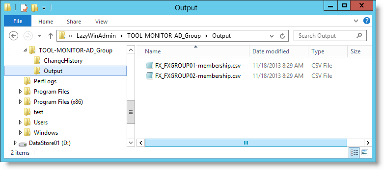
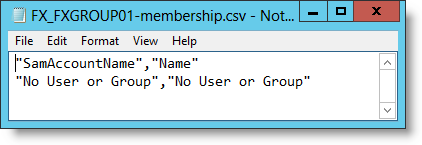
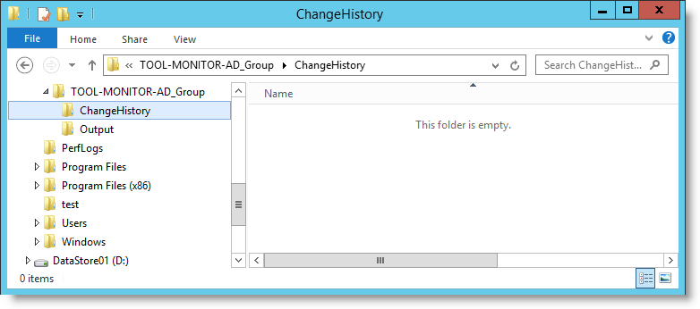
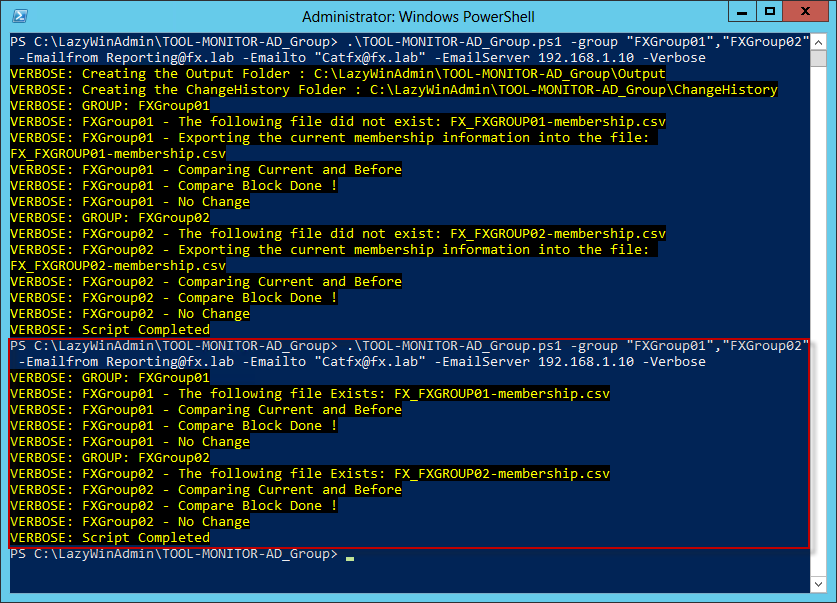
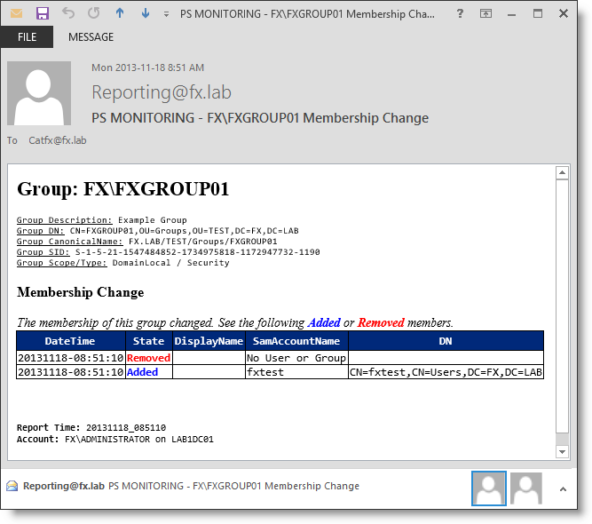

# Monitor-ADGroupMembership

[](https://dev.azure.com/lazywinadmin/Monitor-ADGroupMembership/_build/latest?definitionId=22&branchName=master)

This PowerShell script help you monitor Active Directory groups and send an email when someone is performing a change on the membership.

I wrote a few articles about this script if you are interested to learn more about it:
* [LazyWinAdmin.com](http://www.lazywinadmin.com/2013/11/update-powershell-monitor-and-report.html)

## Contributing

Contributions are welcome via pull requests and issues.
Please see our [contributing guide](CONTRIBUTING.md) for more details

**Thanks to our contributors!:**

Thanks to our wonderful contributors!! We extend our sincere appreciation to you!

* @lazywinadmin
* @ifmorrison
* @McAndersDK
* @revoice1
* @JaimeStill

## Installation

### Download from PowerShell Gallery (PowerShell v5+)

You can install the script directly from the PowerShell Gallery.

``` powershell
Install-Script -name Monitor-ADGroupMembership
```

### Manual Installation

1. Navigate to the `source` folder
1. Click on the `ps1` file
1. Copy the content of the file into notepad and save the file with the name `Monitor-ADGroupMembership.ps1`
1. You are ready to use it.

``` powershell
Install-Script -name Monitor-ADGroupMembership
```


## Schedule the script

On frequent question I get for this script is how to use the Task Scheduler to run this script.

The trick here is to handle the quotes. You need to add back slashes "\" to handle them.

Here is an example:

```text
"C:\Windows\system32\WindowsPowerShell\v1.0\powershell.exe" -command "C:\Scripts\LazyWinAdmin\Monitor-ADGroupMembership.ps1 -group \"Domain Admins\",\"Group1\",\"Enterprise Admins\",\"Group2\",\"Group3\",\"Group4\",\"Group5\",\"Group6\" -Emailfrom \"xxx@mydomain.com\" -Emailto \"xxx@otherdomain.com\" -Emailserver \"smtp.mydomain.local\""
```

## Report Example


## Features

You can specify the group Name, SID(Security Identifier), GUID(Globally Unique IDentifier) or DN (Distinguished Name).
Group name like 'DOMAIN\GROUPNAME' will also work.

**Comparing**
The membership of each group is saved in a CSV file "DOMAIN_GROUPNAME-membership.csv"
If the file does not exist, the script will create one, so the next time it will be able to compare the  membership with this file.

**Change History**
Each time a change is detected (Add or Remove an Account (Nested or Not)) a CSV file will be generated with the following name: "DOMAIN_GROUPNAME-ChangesHistory-yyyyMMdd-hhmmss.csv"

When generating the HTML Report, the script will add this Change History to the Email (if there is one to add)

**Reporting**
Here is an example of report generated when a change is detected.
You can see the user 'catfx' was removed from the group FX\FXGROUP
Also, If the script find some Change History files for this group, it will be added to the report.
Finally at the end of the report, information on when, where and who ran the script.

## Requirements
* Read Permission in Active Directory on the monitored groups
* Module
 * Microsoft ActiveDirectory Module
 * **OR**
 * Quest Active Directory PowerShell Snapin
* A Scheduled Task (in order to check every X seconds/minutes/hours)


## Using the script

``` powershell
.\Monitor-ADGroupMembership.ps1 -group "FXGroup01","FXGroup02" -Emailfrom Reporting@fx.lab -Emailto "Catfx@fx.lab" -EmailServer 192.168.1.10 -Verbose
```

### The first time you run the script

You'll notice that the script is creating folders and files.
At this point you won't get any email report. Example:

``` powershell
.\Monitor-ADGroupMembership.ps1 -group "FXGroup01","FXGroup02" -Emailfrom Reporting@fx.lab -Emailto "Catfx@fx.lab" -EmailServer 192.168.1.10 -Verbose
```


```
VERBOSE: Creating the Output Folder : C:\LazyWinAdmin\Monitor-ADGroupMembership\Output
VERBOSE: Creating the ChangeHistory Folder : C:\LazyWinAdmin\Monitor-ADGroupMembership\ChangeHistory
VERBOSE: GROUP: FXGroup01
VERBOSE: FXGroup01 - The following file did not exist: FX_FXGROUP01-membership.csv
VERBOSE: FXGroup01 - Exporting the current membership information into the file:
FX_FXGROUP01-membership.csv
VERBOSE: FXGroup01 - Comparing Current and Before
VERBOSE: FXGroup01 - Compare Block Done !
VERBOSE: FXGroup01 - No Change
VERBOSE: GROUP: FXGroup02
VERBOSE: FXGroup02 - The following file did not exist: FX_FXGROUP02-membership.csv
VERBOSE: FXGroup02 - Exporting the current membership information into the file:
FX_FXGROUP02-membership.csv
VERBOSE: FXGroup02 - Comparing Current and Before
VERBOSE: FXGroup02 - Compare Block Done !
VERBOSE: FXGroup02 - No Change
VERBOSE: Script Completed
```

Two directories and two files are created:
 * **2 Files** For each of the group we just queried FXGROUP01 and FXGROUP02. Since these groups are currently empty, the script will add the value "No User or Group" in both files.
 * **OUTPUT** Directory Each time the script run, It query the group membership in the Active Directory and save the current membership in the files (It won't touch the file if it's the same membership at each check).
 * **CHANGEHISTORY** Directory contains the list of changes observed by the script. One file per Group per domain, if multiple changes occur, the script will append the change in the same file.


Output Directory contains the **2 files** for each monitored groups



Each file contains the current membership of each groups. Since these are empty the script just create the following file with two properties SamAccountName and Name with the value "No User or Group"



The ChangeHistory Directory is empty at this point since no change was observed by the script.



### Running the script a second time (without change on the groups)
If I re-run the script  we will get the following output.
The script does not see any change in the membership by comparing the content of the file FX_FXGROUP01-membership.csv and the current membership in Active Directory for this group.



### Running the script after a change

Ok now let's make one change and add one account in FXGROUP01 and run the script again.

``` powershell
PS C:\LazyWinAdmin\Monitor-ADGroupMembership> .\Monitor-ADGroupMembership.ps1 -group "FXGroup01","FXGroup02" -Emailfrom Reporting@fx.lab -Emailto "Catfx@fx.lab" -EmailServer 192.168.1.10 -Verbose
```

```
VERBOSE: GROUP: FXGroup01
VERBOSE: FXGroup01 - The following file Exists: FX_FXGROUP01-membership.csv
VERBOSE: FXGroup01 - Comparing Current and Before
VERBOSE: FXGroup01 - Compare Block Done !
VERBOSE: FXGroup01 - Some changes found
DateTime       : 20131118-08:51:10
State          : Removed
DisplayName    :
SamAccountName : No User or Group
DN             :

DateTime       : 20131118-08:51:10
State          : Added
DisplayName    :
SamAccountName : fxtest
DN             : CN=fxtest,CN=Users,DC=FX,DC=LAB
VERBOSE: FXGroup01 - Get the change history for this group
VERBOSE: FXGroup01 - Change history files: 0
VERBOSE: FXGroup01 - Save changes to a ChangesHistory file
VERBOSE: FXGroup01 - Preparing the notification email...
VERBOSE: FXGroup01 - Email Sent.
VERBOSE: FXGroup01 - Exporting the current membership to FX_FXGROUP01-membership.csv
VERBOSE: GROUP: FXGroup02
VERBOSE: FXGroup02 - The following file Exists: FX_FXGROUP02-membership.csv
VERBOSE: FXGroup02 - Comparing Current and Before
VERBOSE: FXGroup02 - Compare Block Done !
VERBOSE: FXGroup02 - No Change
VERBOSE: Script Completed

```

As you can see One account was added **"fxtest"** and the default **"No User or Group"** was removed by the script


### Workflow

Here is the workflow of the script


### Change log

See [changelog.txt](/changelog.txt) file.

### TODO

See [TODO](TODO) file.